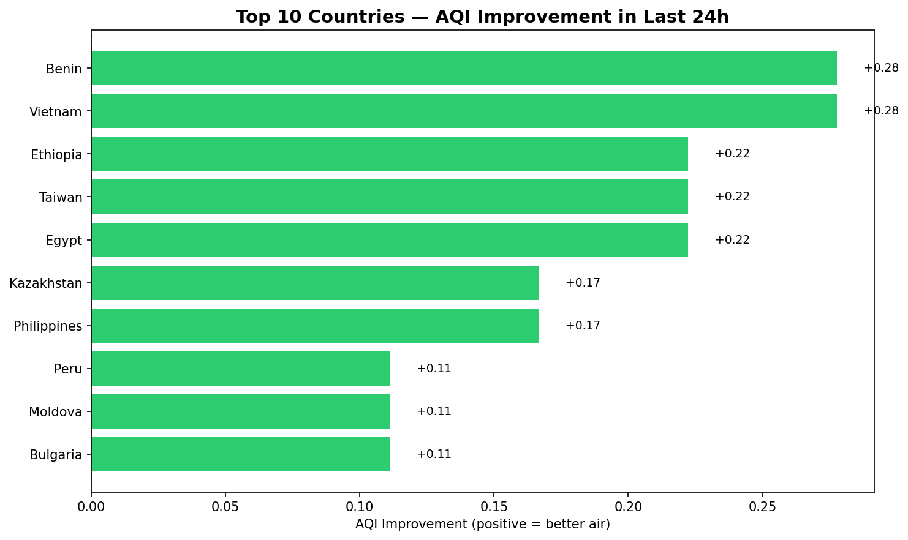
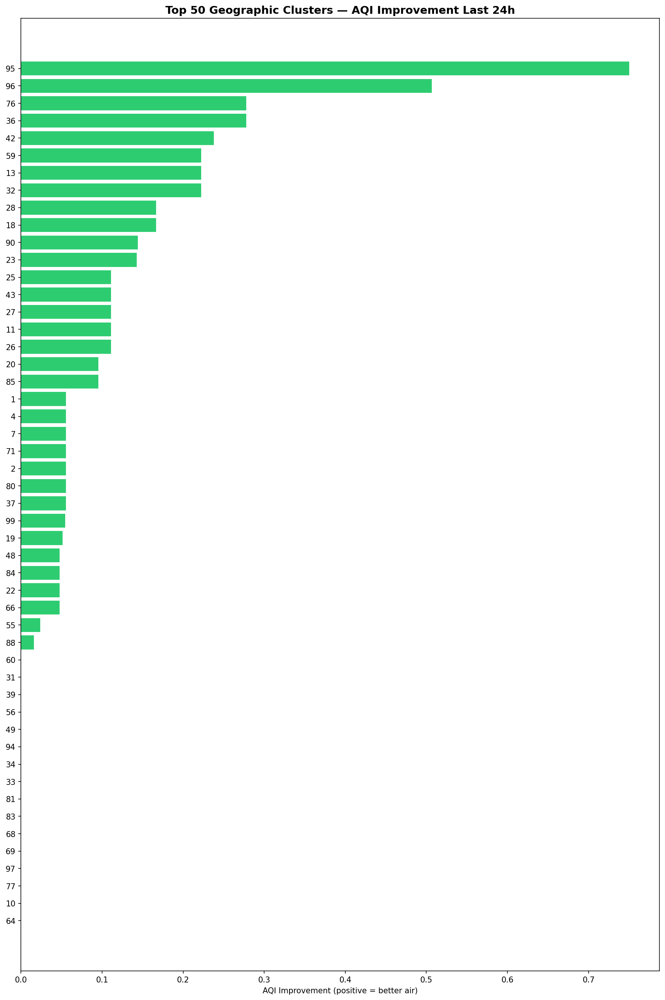
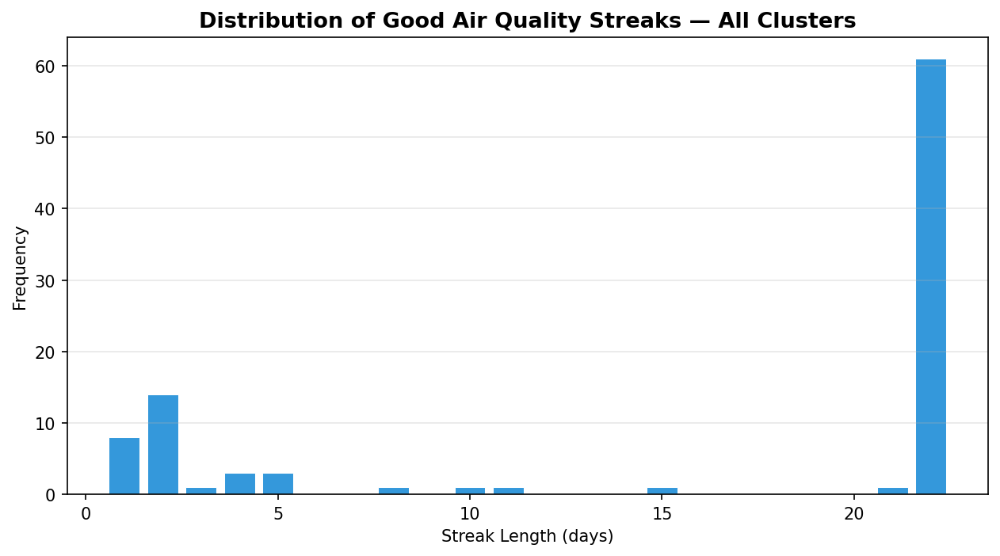

# 🌍 Air Quality Analysis — PySpark Big Data Pipeline


> A production-grade **Big Data pipeline** built on Apache Spark to analyse global particulate air pollution (PM10 / PM2.5) across 600+ sensors in 68 countries over 22 days. Answers three analytical questions using Spark SQL, MLlib K-Means clustering, and PySpark Window functions — with 4 interactive Folium maps as output.

---

## 📋 Table of Contents

- [Overview](#overview)
- [Results](#results)
- [Architecture](#architecture)
- [Data Source & Format](#data-source--format)
- [The Three Analyses](#the-three-analyses)
- [Project Structure](#project-structure)
- [Setup & Installation](#setup--installation)
- [Running the Pipeline](#running-the-pipeline)
- [Technical Decisions](#technical-decisions)
- [Academic Context](#academic-context)

---

## Overview

Air pollution kills **7 million people per year**. Tracking it across thousands of community sensors worldwide is a genuine Big Data problem — 39,600 readings, 22 JSON files, 68 countries, processed end-to-end in **53 seconds** on a single machine.

This pipeline ingests data from the [sensor.community](https://sensor.community) open sensor network and answers three questions:

1. **Which 10 countries improved the most in air quality over the last 24 hours?**
2. **Which 50 geographic regions improved the most** — after spatially clustering 600 sensors with K-Means?
3. **Which regions had the longest consecutive streak of good air quality** (AQI ≤ 3)?

---

## Results

### Analysis 1 — Top 10 Countries by AQI Improvement (last 24h)



| Rank | Country | AQI Improvement |
|:----:|---------|:--------------:|
| 1 | Benin | +0.278 |
| 2 | Vietnam | +0.278 |
| 3 | Ethiopia | +0.222 |
| 4 | Taiwan | +0.222 |
| 5 | Egypt | +0.222 |
| 6 | Kazakhstan | +0.167 |
| 7 | Philippines | +0.167 |
| 8 | Peru | +0.111 |
| 9 | Moldova | +0.111 |
| 10 | Bulgaria | +0.111 |

> Worst AQI today: Bangladesh (10.0), Nigeria (9.3), India (8.9), Pakistan (8.7), China (7.2)

---

### Analysis 2 — Top 50 Geographic Clusters (K-Means, K=100)



K-Means trained on 600 unique GPS sensor positions. Elbow method applied over K=10 to 100 — training cost (inertia): **15,912.55**.

Top improving clusters are located in South/Southeast Asia and West Africa — consistent with Analysis 1.

---

### Analysis 3 — Longest Good Air Quality Streaks



> Good air quality = cluster daily average AQI ≤ 3

- **22 clusters** maintained good air quality for the **full 22-day window** (Scandinavia, Oceania, parts of Europe)
- **Bangladesh, Egypt, Nigeria** : 0 consecutive good days
- Global average max streak: **12.3 days**

---

## 🗺️ Interactive Maps

Click to open the interactive maps (rendered via htmlpreview):

| Map | Description |
|-----|-------------|
| [🌍 Country AQI Map](https://htmlpreview.github.io/?https://github.com/firaszaarouri/air-quality-spark/blob/main/assets/map_country_aqi.html) | Choropleth — average AQI by country today |
| [📍 Cluster Improvement Map](https://htmlpreview.github.io/?https://github.com/firaszaarouri/air-quality-spark/blob/main/assets/map_cluster_improvement.html) | Top 50 clusters coloured by AQI improvement |
| [🔵 Cluster Zones Map](https://htmlpreview.github.io/?https://github.com/firaszaarouri/air-quality-spark/blob/main/assets/map_cluster_zones.html) | Geographic distribution of all 100 K-Means clusters |
| [📊 Streak Popup Map](https://htmlpreview.github.io/?https://github.com/firaszaarouri/air-quality-spark/blob/main/assets/map_streak_popups.html) | Click any cluster to see its streak histogram |

> **Tip:** The Streak Popup Map is the most interactive — click each marker to see a Vega-Lite histogram of that cluster's good air quality streak distribution.


---

## Architecture

```
┌──────────────────────────────────────────────────────────────────────┐
│                          main.py (Orchestrator)                      │
└──────────────┬─────────────────────────────────────────┬────────────┘
               │                                         │
               ▼                                         ▼
┌──────────────────────────┐              ┌──────────────────────────┐
│  data_generator.py       │              │  pipeline/ingestion.py   │
│                          │              │                          │
│  600 sensors × 22 days   │  ──JSON──▶  │  Spark SQL extraction    │
│  68 countries            │              │  PM10/PM2.5 → AQI        │
│  39,600 readings         │              │  Country code join        │
│  22 JSON files           │              │  Cache DataFrame          │
└──────────────────────────┘              └──────────┬───────────────┘
                                                     │
                         ┌───────────────────────────┼───────────────────────┐
                         │                           │                       │
                         ▼                           ▼                       ▼
          ┌──────────────────────┐  ┌─────────────────────┐  ┌─────────────────────┐
          │  Analysis 1          │  │  Analysis 2          │  │  Analysis 3         │
          │  Country ranking     │  │  K-Means K=100       │  │  Window functions   │
          │  Spark SQL + agg     │  │  Cluster ranking     │  │  Streak algorithm   │
          │  Negation trick      │  │  MLlib + pandas join │  │  dual-window trick  │
          └──────────┬───────────┘  └──────────┬──────────┘  └──────────┬──────────┘
                     └──────────────────────────┴─────────────────────────┘
                                                │
                                                ▼
                                 ┌──────────────────────────┐
                                 │  pipeline/visualisation  │
                                 │  4 Folium HTML maps      │
                                 │  3 matplotlib charts     │
                                 │  → output/               │
                                 └──────────────────────────┘
```

---

## Data Source & Format

Real data source: [sensor.community](https://sensor.community) — open sensor network of 14,000+ volunteer sensors worldwide.

This project includes a **synthetic data generator** (`data_generator.py`) that simulates 600 sensors across 90 real cities with realistic regional pollution profiles:

| Region | Typical PM10 | Typical PM2.5 | Typical AQI |
|--------|:---:|:---:|:---:|
| Scandinavia | 7–10 µg/m³ | 4–6 µg/m³ | 1–2 |
| Western Europe | 18–30 µg/m³ | 10–18 µg/m³ | 2–4 |
| Eastern Europe | 40–70 µg/m³ | 25–48 µg/m³ | 4–7 |
| India | 70–180 µg/m³ | 45–120 µg/m³ | 7–10 |
| Bangladesh | 160 µg/m³ | 110 µg/m³ | 10 |

**JSON format** (sensor.community API):
```json
{
  "timestamp": "2026-03-19 07:00:00",
  "location": { "country": "FR", "latitude": "48.856", "longitude": "2.352" },
  "sensor": { "id": 1 },
  "sensordatavalues": [
    { "value_type": "P1", "value": "22.5" },
    { "value_type": "P2", "value": "14.1" }
  ]
}
```

**AQI Scale:** European CAQI — PM10 and PM2.5 converted to a 1–10 integer scale. AQI = max(AQI_PM10, AQI_PM25).

---

## The Three Analyses

### Analysis 1 — Country Ranking

```python
# Filter → avg per day → negate today → sum → rank
two_days.groupBy("country", "date").agg(avg("AQI"))
        .withColumn("avg_AQI", when(date==today, -col("avg_AQI")).otherwise(col("avg_AQI")))
        .groupBy("country").agg(sum("avg_AQI"))
        .orderBy(desc("AQI_improvement"))
```

No self-join needed — negating today's AQI and summing gives `yesterday − today` in one pass.

### Analysis 2 — Geographic Clustering

```python
# Train K-Means on unique GPS positions
assembler = VectorAssembler(inputCols=['latitude','longitude'], outputCol='geo')
kmeans = KMeans().setK(100).setSeed(42).setFeaturesCol('geo')
model = kmeans.fit(training_data)
model.save('kmeans_model')          # saved — no retrain on next run
df_clustered = model.transform(df)  # assign cluster to every reading
```

Same improvement logic as Analysis 1, grouped by cluster instead of country. Centroid coordinates joined in pandas to avoid `createDataFrame` issues on Python 3.14+.

### Analysis 3 — Streak Algorithm

```python
# Dual-window trick — no Python UDFs, fully distributed
w1 = Window.partitionBy("cluster").orderBy("date")
w2 = Window.partitionBy("cluster", "LowIndex").orderBy("date")
grp = row_number().over(w1) - row_number().over(w2)    # streak group ID

w3 = Window.partitionBy("cluster", "LowIndex", "grp").orderBy("date")
streak = when(LowIndex==0 | LowIndex==next_LowIndex, 0).otherwise(row_number().over(w3))
```

`grp` creates a unique identifier for each consecutive run. `row_number()` over `w3` then counts the length of each good-air streak.

---

## Project Structure

```
air-quality-spark/
│
├── main.py                    # Orchestrator — run this
├── config.py                  # All configuration in one place
├── data_generator.py          # Synthetic sensor data generator
├── requirements.txt
├── README.md
├── .gitignore
│
├── pipeline/
│   ├── __init__.py
│   ├── ingestion.py           # Spark session, data loading, AQI conversion
│   ├── analysis.py            # The 3 analyses + matplotlib charts
│   └── visualisation.py      # 4 Folium interactive maps
│
├── assets/                    # Screenshots for README (add after first run)
│   ├── top10_countries.png
│   ├── top50_clusters.png
│   └── streak_analysis.png
│
├── data/                      # JSON sensor files (git-ignored)
└── output/                    # All outputs (git-ignored)
    ├── top10_countries.png
    ├── top50_clusters.png
    ├── streak_distribution.png
    ├── map_country_aqi.html
    ├── map_cluster_improvement.html
    ├── map_cluster_zones.html
    └── map_streak_popups.html
```

---

## Setup & Installation

### Prerequisites

- Python 3.10+
- **Java 17+** (required by Spark) — [Download Temurin 17](https://adoptium.net/temurin/releases/?version=17)
- **Windows only:** `winutils.exe` + `hadoop.dll` in `C:\hadoop\bin\`, with `HADOOP_HOME=C:\hadoop`

### Install

```bash
git clone https://github.com/firaszaarouri/air-quality-spark
cd air-quality-spark
pip install -r requirements.txt
```

---

## Running the Pipeline

### First run — generate data + full analysis

```bash
python main.py --generate-data
```

### Subsequent runs (data already exists)

```bash
python main.py
```

### Other options

```bash
python main.py --elbow            # Run Elbow Method to validate K choice
python main.py --retrain          # Force retrain K-Means model
python main.py --no-maps          # Skip Folium maps (faster)
python main.py --generate-data --days 30   # Custom number of days
```

### View interactive maps

```bash
# Open all 4 maps in your browser
open output/map_country_aqi.html
open output/map_cluster_improvement.html
open output/map_cluster_zones.html
open output/map_streak_popups.html
```

---

## Technical Decisions

### Read once, cache
JSON files are read exactly once. The resulting DataFrame is `.cache()`d before all 3 analyses — avoiding repeated disk reads at scale.

### Filter before groupBy
Every analysis applies `.filter()` before `.groupBy()`, reducing data volume for all downstream aggregations — critical at Big Data scale.

### Negation trick (no self-join)
Instead of joining yesterday's and today's DataFrames (expensive shuffle), today's AQI is negated. `sum(AQI_yesterday + (-AQI_today))` = improvement in one `groupBy` pass.

### K-Means model persistence
Trained model saved to `kmeans_model/`. Subsequent runs load it without retraining — essential when working with large real datasets.

### Window functions over Python UDFs
The streak algorithm uses only Spark SQL Window functions. Python UDFs bypass the Catalyst optimizer and run row-by-row — the Window approach stays fully distributed.

### Python 3.14 compatibility
`spark.createDataFrame(pandas_df)` crashes on Python 3.14 due to socket handling changes. Centroid coordinates are joined in pandas after `.toPandas()` instead.

---

## Academic Context

This project was developed as part of the **Big Data & Machine Learning** module at **Cranfield University** (MSc Data Analytics).

Technologies: Apache Spark 4.1, PySpark, Spark SQL, MLlib K-Means, PySpark Window functions, Folium, Altair, Branca.

---

## Author

**Firas Zaarouri** — MSc Data Analytics, Cranfield University
PhD Candidate, LIP6 Sorbonne Université (NPA Team)
[github.com/firaszaarouri](https://github.com/firaszaarouri)
